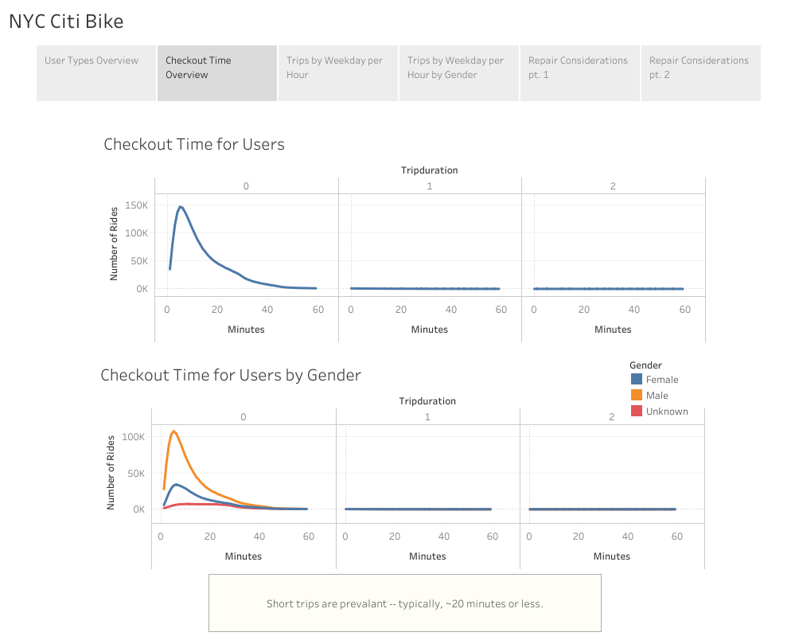

## Overview

Now that we've gotten a good idea of how to create our story, there is still some more work to be done to convince investors that a bike-sharing program in Des Moines is a solid business proposal. To solidify the proposal, one of the key stakeholders would like to see a bike trip analysis.

## Results

The Tableau results of our analyis can be accessed directly [here](https://public.tableau.com/authoring/NYCCitiBike_16568904110750/NYCCitiBikeStory#1). For convenience, they have been replicated below as well. 

### User Types Overview

### Checkout Time Overview

### Trips by Weekday per Hour

### Trips by Weekday per Hour by Gender

### Repair Considerations pt. 1

### Repair Considerations pt. 2

## Summary 

As included in the above analysis, our primary insights are as follows: 

* riders primarily consist of subscribers, which mean steady, more guaranteed income 
* ridership for women is significantly lower than ridership for men; some investigation is likely warranted, but we might start with the hypothesis that "ridership for women is less than ridership for men because there is a lack of a variety of bicycle sizes available" 
* most rides are ~20 minutes or less
* most rides occur during "rush hour" times, likely to commute to and / or from work 
* a number of bicycles in our fleet were approaching nearly 500 rides; more investigation is necessary to outline a comprehensive maintenance and replacement schedule 

### Additional considerations

If we were to examine this dataset further, the following two analyses and visualizations would be helpful: 

1. examine repeat riders, especially by geographic location; this could help us to determine how to better serve users, placing bicycles in locations where we might garner additional repeat riders
2. review user type by birth year; we may wish to streamline payment options or the app UI if we find that there is a trend by birth year leaning toward a particular user type (customer or subscriber)